### 瑞吉外卖项目笔记

## 菜品管理

### Bug 1

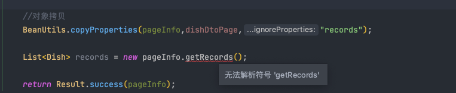

菜品信息分页查询，无法展示菜品分类信息，需要将对象拷贝。这里无法解析符号。

原因：手残，多写了一个new，上边已经定义过`pageInfo`


#### 添加菜品停售功能


## 套餐管理

### Bug 1

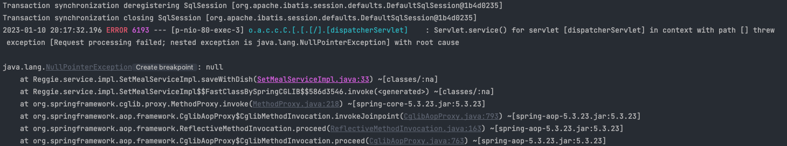

在dto中的变量名与实体类中的变量名不一致，导致在调用`SetMealServiceImpl`时出现空指针异常。


### Bug 2

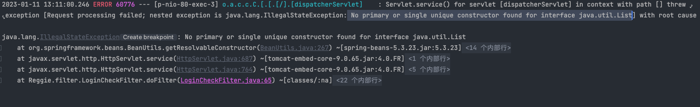

错误：No primary or single unique constructor found for interface java.util.List(没有为[List接口](https://so.csdn.net/so/search?q=List接口&spm=1001.2101.3001.7020)找到主要的或唯一的构造函数)

原因：请求的参数没有匹配上处理函数的参数

在这里忘记添加`@RequestParam `注解了

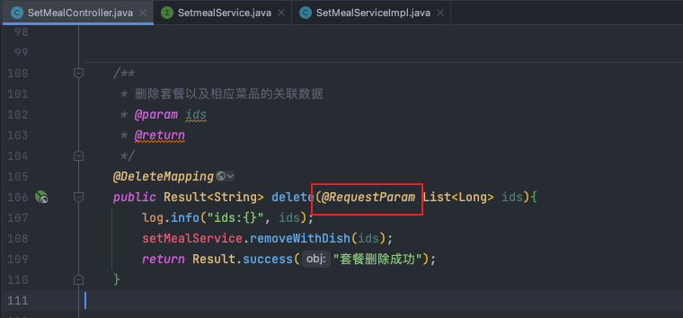


### 修改套餐功能

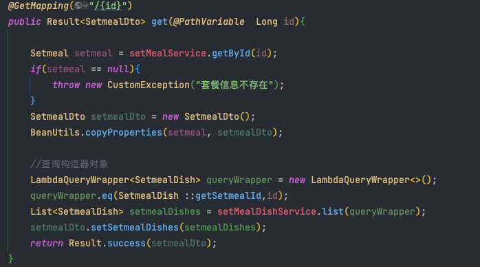

首先根据id获取到对应的套餐信息

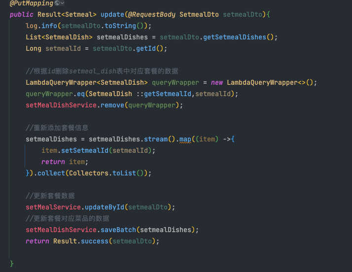

在对套餐进行更新时，首先删除掉原有的套餐信息，然后重新添加新的套餐信息以及套餐对应的菜品信息

## 验证码发送

这里使用手机验证码需要收费，因此替换为邮件发送验证码。

- 登录流程:
  - 输入手机号（邮箱） > 获取验证码 > 输入验证码 > 点击登录 > 登录成功

创建实体类User：

```java
package Reggie.entity;


import lombok.Data;
import java.time.LocalDateTime;
import java.util.Date;
import java.util.List;
import java.io.Serializable;
import com.baomidou.mybatisplus.annotation.IdType;
import com.baomidou.mybatisplus.annotation.TableId;
/**
 * 用户信息
 */
@Data
public class User implements Serializable {

    private static final long serialVersionUID = 1L;

    private Long id;
    
    //姓名
    private String name;
    
    //手机号
    private String phone;
    
    //性别 0 女 1 男
    private String sex;

    //身份证号
    private String idNumber;
    
    //头像
    private String avatar;
    
    //状态 0:禁用，1:正常
    private Integer status;
}

```

Mapper接口UserMapper

```java
@Mapper
public interface UserMapper extends BaseMapper<User> {}
```

业务层接口UserService

```java
public interface UserService extends IService<User> {
}
```

业务层实现类UserServiceImpl

```java
@Service
public class UserServiceImpl extends ServiceImpl<UserMapper,User> implements UserService{
}
```

导入邮箱发送验证码的坐标，这里使用 springboot 的mail

```xml
<dependency>
      <groupId>org.springframework.boot</groupId>
      <artifactId>spring-boot-starter-mail</artifactId>
    </dependency>
```

邮件发送接口

```java
public interface SendMailService  {
    /**
     * 发送邮件
     * @param to
     */
    void sendMail(String to);
    
    void sendMail(String to,String code);

    /**
     * 获取验证码
     * @return
     */
    String achieveCode();
}
```

邮件发送接口类实现：

```java
@Service
public class SendMailServiceImpl implements SendMailService {
    @Autowired
    private JavaMailSender mailSender;

    //发送人
    @Value("${spring.mail.username}")
    private String from;

    @Value("${spring.mail.nickname}")
    private String nickname;
    //标题
    private String subject = "登录验证码";
    
    @Override
    public void sendMail(String to) {
        String code = achieveCode();
        //正文
        String context = "尊敬的用户:你好!\n注册验证码为:" + code + "(有效期为一分钟,请勿告知他人)";
        SimpleMailMessage message = new SimpleMailMessage();
        message.setFrom(nickname+'<'+from+'>');
        message.setTo(to);
        message.setSubject(subject);
        message.setText(context);
        mailSender.send(message);
    }
    @Override
    public void sendMail(String to, String code) {
        String context = "尊敬的用户:你好!\n注册验证码为:" + code + "(有效期为一分钟,请勿告知他人)";
        SimpleMailMessage message = new SimpleMailMessage();
        message.setFrom(nickname+'<'+from+'>');
        message.setTo(to);
        message.setSubject(subject);
        message.setText(context);
        mailSender.send(message);
    }
    
    @Override
    public  String achieveCode() {  //由于数字 1 、 0 和字母 O 、l 有时分不清楚，所以，没有数字 1 、 0
        String[] beforeShuffle = new String[]{"2", "3", "4", "5", "6", "7", "8", "9", "A", "B", "C", "D", "E", "F",
                "G", "H", "I", "J", "K", "L", "M", "N", "O", "P", "Q", "R", "S", "T", "U", "V", "W", "X", "Y", "Z", "a",
                "b", "c", "d", "e", "f", "g", "h", "i", "j", "k", "l", "m", "n", "o", "p", "q", "r", "s", "t", "u", "v",
                "w", "x", "y", "z"};
        List<String> list = Arrays.asList(beforeShuffle);//将数组转换为集合
        Collections.shuffle(list);  //打乱集合顺序
        StringBuilder sb = new StringBuilder();
        for (String s : list) {
            sb.append(s); //将集合转化为字符串
        }
        return sb.substring(3, 8).toUpperCase();
    }
}
```

控制层发送验证码：

```java
@PostMapping("/sendMsg")
public Result<String> sendMsg(@RequestBody User user, HttpSession httpSession){
    //获取邮箱地址(手机号)
    String phone = user.getPhone();
    if(!StringUtils.isEmpty(phone)){
        //生成验证码
        String code = sendMailService.achieveCode();
        //生成4位随机验证码
        //String intCode = ValidateCodeUtils.generateValidateCode(4).toString();
        log.info("生成的验证码为：{}",code);
        //发送验证码
        sendMailService.sendMail(user.getPhone(),code);
        //将验证码保存到session
        httpSession.setAttribute(phone,code);

        return Result.success("验证码发送成功");

    }

    return Result.error("验证码发送失败");

}


/**
 * 移动端用户登录
 * @param map
 * @param session
 * @return
 */
@PostMapping("/login")
public Result<User> login(@RequestBody Map map, HttpSession session){
    log.info(map.toString());
    //获取手机号
    String phone = map.get("phone").toString();

    //获取验证码
    String code = map.get("code").toString();

    //从session中获取保存的验证码
    Object codeInSession = session.getAttribute(phone);

    //进行验证码的比对（页面提交的验证码和session中保存的验证码比对）
    if(codeInSession != null && codeInSession.equals(code)){
        //如果对比成功，登录成功
        //判断当前手机对应的用户是否为新用户，如果是完成自动注册
        LambdaQueryWrapper<User> queryWrapper = new LambdaQueryWrapper<>();
        queryWrapper.eq(User::getPhone,phone);

        User user = userService.getOne(queryWrapper);
        if(user == null){
            //新用户自动完成注册
            user = new User();
            user.setPhone(phone);
            user.setStatus(1);
            userService.save(user);
        }
        session.setAttribute("user",user.getId());
        return Result.success(user);

    }

    return Result.error("登录失败");

}
```


### Git 设置

```bash
//设置用户信息
git config --global user.name ""
git config --global user.email ""
//列出配置信息
git config --list

//获取git仓库，从远程仓库克隆(常用)
```

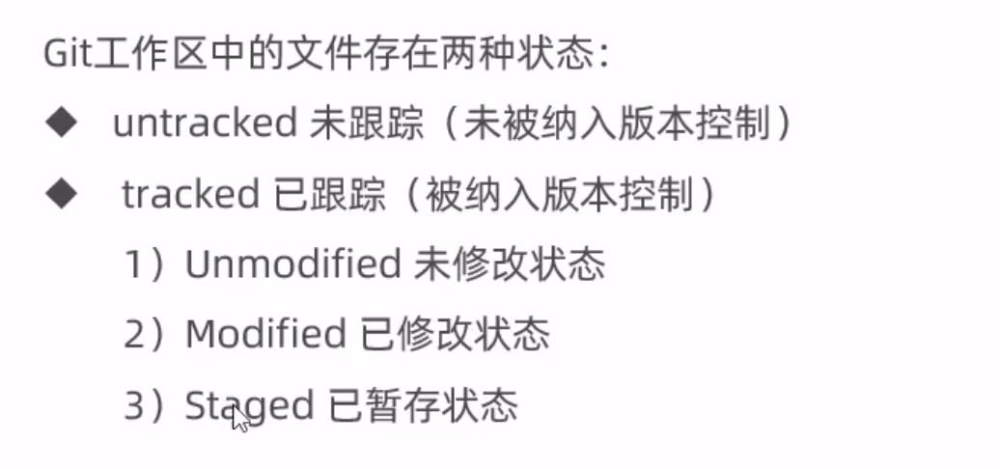

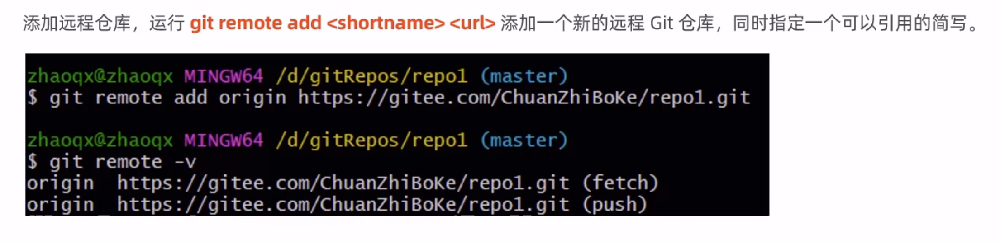


**git 上传设置**

```bash
git branch -m main master
git fetch origin
git branch -u origin/master master
git remote set-head origin -a
```


```
1、在github上创建项目
2、使用git clone 克隆到本地
3、编辑项目
4、git add . 添加改动
5、git commit -m "提交说明"
6、git push origin master 将本地更改推送到远程master分支。

添加仓库：
```

如果在github的remote上已经有了文件，会出现错误。此时应当先pull一下，即：

```bash
git pull origin master
```


**Git 分支**

分支可以吧目前的工作从主线上分离开来，避免影响开发主线，同一个仓库可以有多个分支，各个分支相互独立，互不干扰。

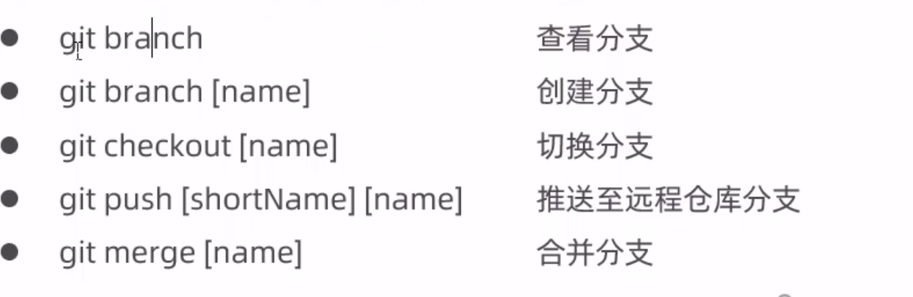

```
git branch //列出本地分支
git branch -r //列出远程分支
git branch -a //列出本地分支和远程分支
```

**Git 标签**

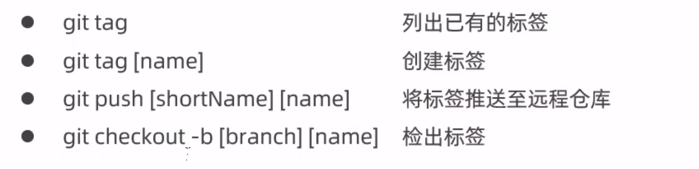


### Linux部分

**Tomcat 设置**

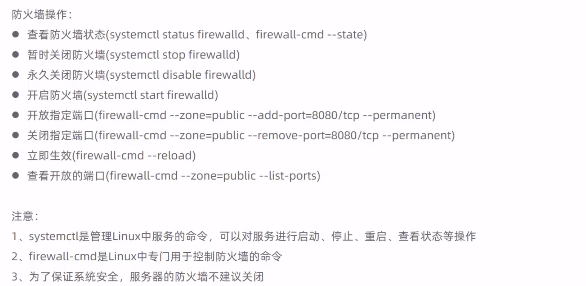


## 代码优化

### redis 缓存验证码

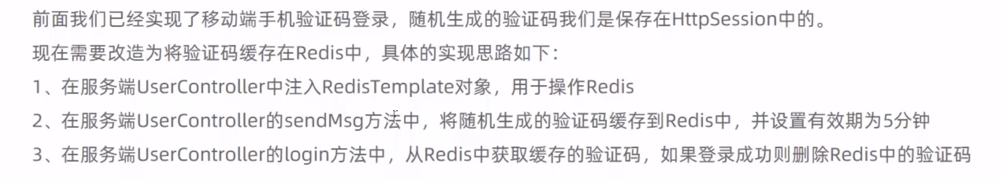

```java
//将生成的验证码缓存到Redis中，并设置有效期为5分钟
redisTemplate.opsForValue().set(phone,code,5, TimeUnit.MINUTES);
//从redis中取出验证码
Object codeInSession = redisTemplate.opsForValue().get(phone);
```

### 缓存菜品数据

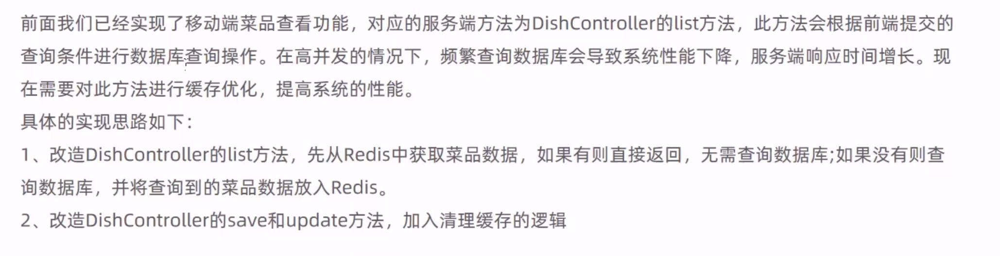


### 使用 swagger 生成接口文档

导入坐标
```xml
<dependency>
      <groupId>com.github.xiaoymin</groupId>
      <artifactId>knife4j-spring-boot-starter</artifactId>
      <version>3.0.2</version>
    </dependency>
```

在 WebMvcConfig添加相应的注解

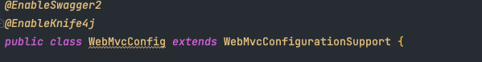

配置：

```java
 @Bean
    public Docket createRestApi() {
        //文档类型
        return new Docket(DocumentationType.SWAGGER_2)
                .apiInfo(apiInfo())
                .select()
                .apis(RequestHandlerSelectors.basePackage("Reggie.controller"))
                .paths(PathSelectors.any())
                .build();
    }

    private ApiInfo apiInfo() {
        return new ApiInfoBuilder()
                .title("瑞吉外卖")
                .version("1.0")
                .description("Reggie 接口文档")
                .build();
    }
```

在拦截器中配置过滤路径，并设置静态资源映射

```java
"/doc.html",
"webjars/**",
"/swagger-resources",
"/v2/api-docs"
```

```java
registry.addResourceHandler("doc.html").addResourceLocations("classpath:/META-INF/resources/");
registry.addResourceHandler("/webjars/**").addResourceLocations("classpath:/META-INF/resources/webjars/");
```

相关注解：

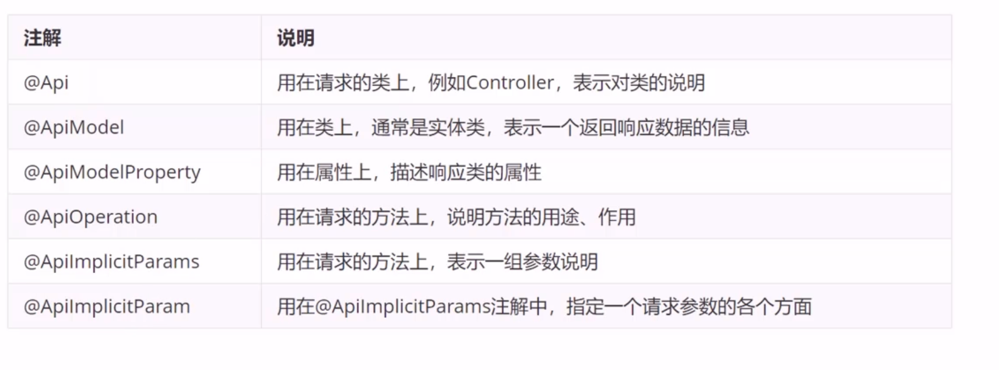

搭配注解可以可以使内容更加完善
